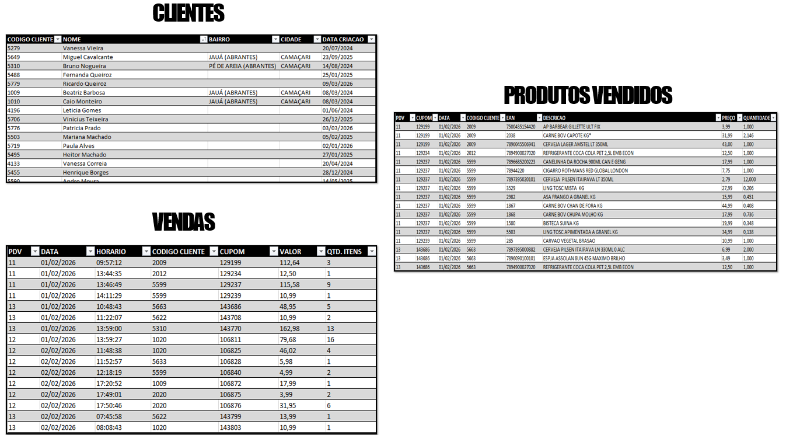
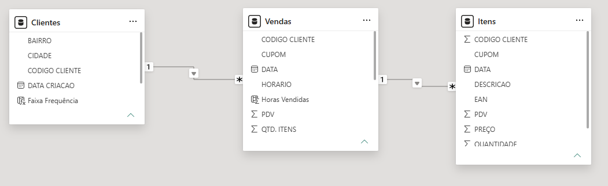
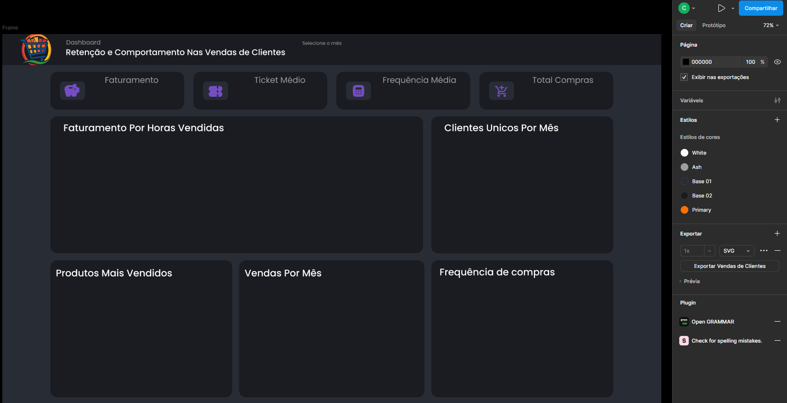
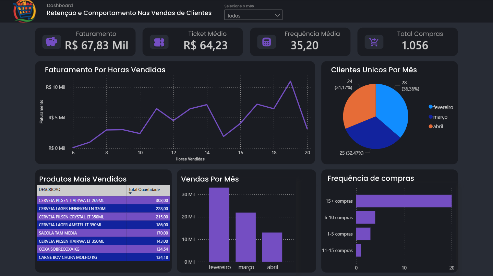

# Retenção e Comportamento Nas Vendas de Clientes de um Supermercado
---
## Sobre o Projeto 📌
Este projeto apresenta uma análise de retenção e comportamento de compra de clientes de um supermercado durante um trimestre, o nome dos clientes foram anonimizados para preservação da confidencialidade. O cenário analisado envolve um varejista que identificou uma redução nas vendas realizadas para clientes cadastrados ao longo dos últimos meses, levantando a hipótese de perda de recorrência e diminuição do engajamento dos consumidores.

## Objetivo 🎯
Analisar o comportamento de compra dos clientes, identificar possíveis causas para a queda no faturamento e propor soluções para a resolução do problema. Será necessario construir um fluxo analítico capaz de:

✅ Extrair dados do banco SQL Server  
✅ Consolidar clientes, vendas e itens vendidos  
✅ Aplicar processo ETL  
✅ Criar métricas analíticas  
✅ Desenvolver dashboard executivo  
✅ Apoiar decisões comerciais

## Tecnologias Utilizadas 🛠
- SQL
- Excel
- Power Bi
- DAX
- Figma

## Abordagem 🔍
O projeto seguiu um fluxo completo de ETL:

SQL Server > Extração SQL > Excel > Power BI > DAX > Dashboard Executivo > Insights de negócio

### - Etapa de extração

Foram realizadas consultas diretamente no banco SQL Server do sistema da empresa para coletar:

- Cadastro de clientes
- Vendas realizadas
- Itens vendidos
- Horários de compra
- Frequência de clientes
- Produtos comercializados

Período analisado:

📅 Fevereiro, Março e Abril de 2026

Segue abaixo a consulta que fiz no SQL para extrair os dados das três tabelas utilizadas: clientes, vendas e itens.
```bash
# Consultando a tabela do cadastro dos clientes para extração
select id, nome, bairro, cidade, CAST(datacriacao AS DATE) AS data_criacao  from CADASTRO_PESSOAS where cliente = 1;

# Consultando a tabela das vendas de clientes cadastrados para extração
select
    ecf, 
    CAST(datacupom AS DATE) AS Data_Cupom,
	CONVERT(VARCHAR(8), horacupom, 108) AS Horario,
    cliente,
	coo,
    REPLACE(CAST(totalliquido AS VARCHAR), '.', ',') AS totalliquido, 
    QTDITENS
FROM pdv_cupom
WHERE cliente > 0 
  AND DATACUPOM > '2026-03-31' 
  AND DATACUPOM < '2026-04-22';

# Consultando os itens vendidos desses cupons para extração
select p.ecf, p.coo, CAST(c.datacupom AS DATE) AS Data_Cupom, c.cliente, p.ean, p.descricao, REPLACE(CAST(p.precovarejo AS VARCHAR), '.', ',') AS preco, REPLACE(CAST(p.QUANTIDADE AS VARCHAR), '.', ',') quantidade
from PDV_CUPOM_PRODUTOS p inner join pdv_cupom c on p.coo = c.coo and p.ecf = c.ecf and p.datacupom = c.datacupom 
where c.cliente > 0 and p.cancelado = 0 and p.DATACUPOM > '2026-03-31' AND p.DATACUPOM < '2026-04-22';
```



## - Criação do Dashboard

Após a etapa de extração, os dados foram organizados e exportados para planilhas em excel. Em seguida, as bases foram importadas para o Power BI, onde foi realizada a modelagem dos dados, criação de colunas calculadas e desenvolvimento de medidas DAX para construção dos indicadores analíticos. 

Segue abaixo a modelagem feita no power bi, com o objetivo de estruturar os relacionamentos entre as tabelas e permitir análises mais dinâmicas e integradas dentro do dashboard.



O dashboard foi desenvolvido com o objetivo de transformar dados operacionais em informações estratégicas, permitindo ao gestor visualizar o desempenho do negócio e apoiar o processo de tomada de decisão. Após criar a estrutura dos cards e gráficos, o design do dashboard foi construido no figma, a fim de ter um acabamento gráfico mais agradável estéticamente e funcional.



Os indicadores foram divididos em três perspectivas principais:

- **Operacional:** volume de vendas, frequência de compras e movimentação de clientes;
- **Financeira:** faturamento, ticket médio e evolução mensal das receitas;
- **Comportamental:** perfil de consumo, recorrência, produtos mais vendidos e padrões de compra.



Para explorar o dashboard completo, incluindo filtros e interações disponíveis no Power BI, acesse: **[Abrir Dashboard Interativo](https://app.powerbi.com/view?r=eyJrIjoiNjljNTg0MGItZjg2YS00NzA2LThmZTAtOGMzZTM0YmFhMzViIiwidCI6IjVkZDNjMWFmLTE3MDctNGQyMy04M2U2LTJmNjM4NWM2M2FmNiJ9)**

## Principais Descobertas 🚀

### - Queda progressiva de vendas

Foi observada redução contínua, tanto o volume de vendas quanto o faturamento apresentaram retração.

Fevereiro > Março > Abril

Indício: Possível perda de recorrência dos clientes cadastrados, perda de engajamento e ausência de mecanismos de fidelização..

### - Dependência comercial concentrada
A análise dos itens mostrou alta participação de cervejas entre os produtos mais vendidos, isso sugere:

•	concentração de receita 
•	risco operacional 
•	oportunidade de venda cruzada

## - Redução da atividade dos clientes cadastrados

Foi identificada uma diminuição do número de clientes únicos ativos ao longo do trimestre analisado.

Além da queda no faturamento, houve redução na participação dos clientes recorrentes, indicando possível perda de retenção.

Indícios:

• redução da frequência de compras
• aumento do intervalo entre visitas
• enfraquecimento do relacionamento com clientes cadastrados

## Propostas sugeridas 💡

Com base nos resultados encontrados foram propostas algumas ações:

### - Campanha de reativação

Criar campanhas para clientes sem compras nos últimos 30 dias:

Exemplo:

**"Volte para o mercado"**

Oferta de descontos ou benefícios específicos.

### - Programa de fidelidade

Criar incentivo de recorrência:

- Compras acima de R$100
- Geração de cupom para próxima visita
- Estímulo à segunda compra

### - Cross-selling

Reposicionar produtos de maior demanda:

Exemplo:

Cerveja + carvão + carnes + petiscos + itens para churrasco

Objetivo:

Transformar compras isoladas em compras de cesta completa.
